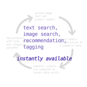

<!-- _class: lead 
_backgroundColor: #4527a4;
-->

---

## Problem: Integrating AI and applying AI to data is a huge challenge

The AI lifecycle is highly complex, interdependent but fragmented.
Various stages in the lifecycle are supported by distinct competing
providers.

Huge overhead because different workflows and tooling fragmented.

---

## Problem: Integrating AI and applying AI to data is a huge challenge

The AI lifecycle is highly complex, interdependent but fragmented.
Various stages in the lifecycle are supported by distinct competing
providers.

Huge overhead because different workflows and tooling fragmented.

---

## Problem: Traditional AI is not able to work directly with incoming information

**New models can now do these things:**

- Search semantically for new information streaming live
- Handle unseen datapoints 
- Lookup information in databases
- Synthesise output based on information found in a database

---

## Problem: Companies do not own their data and AI

### Companies want:

- 100% control over their deployments and development
- To avoid vendor lock-in by cloud providers
- Transparency & auditability on what code and infrastructure is applied to their data

*They want to do these things in an agile and modular fashion.*

---

## Data and AI need to be fully united in order to maximize their value

---

## SuperDuperDB

### The all encompassing AI-database solution

---

## SuperDuperDB

### Uniting best in class database and deep learning software

---

## Solution: SuperDuperDB is a unified environment for the entire AI-data workflow

---

## Solution: SuperDuperDB enables brand-new varieties of AI model

**With SuperDuperDB models can be made to do these things:**

- Search semantically for new information streaming live
- Handle unseen datapoints 
- Lookup information in databases
- Synthesise output based on information found in a database

---

## Solution: Owning data and AI

### The SuperDuperDB core codebase will be open sourced under Apache License 2.0

Companies will be able to deploy their AI and models in a unified way in their own data centers.

Solutions will no longer be intransparent and locked in behind a SAAS or cloud provider.

---

## Example: e-Commerce AI

---

## Example: e-Commerce AI

---

## SuperDuperDB enables a range of well tested business models

- Tiered managed cloud service
- On premises solution with technical support
- Model repository (like "App Store")
- Consulting
- Certifications

---

## Using SuperDuperDB we will be instantly enabled wherever AI provides substantial value

- LegalTech
  - Advanced document analysis
- e-Commerce
  - Search, Navigation, Recommendation
- Biomedical
  - Semantic image segmentation
- Cybersecurity
  - Fraud detection

---

## The potential market for SuperDuperDB is huge

### 2019

---

## ... and rapidly growing

### 2022 

---

## ... and rapidly growing

### 2023 onwards

---

## With SuperDuperDB we aim to

### ... make large in-roads into the managed database market

Managed databases is a huge market with unprecedented growth (source: [gartner.com](https://blogs.gartner.com/merv-adrian/2022/04/16/dbms-market-transformation-2021-the-big-picture/))

---

## ...and the managed AI software market

AI software is a burgeoning new market already with huge reach (source: [gartner.com](https://www.gartner.com/en/newsroom/press-releases/2021-11-22-gartner-forecasts-worldwide-artificial-intelligence-software-market-to-reach-62-billion-in-2022))

---

## SuperDuperDB is already in full swing

### Progress

- Working prototype v0.1 in Python
- Installable via Python `pip`
- Initial traction via social media
- Response positive

---

## Team: SuperDuperDB draws on over a decade of experience in managed AI

### Duncan Blythe [:link:](https://www.linkedin.com/in/duncan-blythe-71877312b/)

- Graduated first in class Oxford Mathematics 2007, MMathPhil, MSc, PhD
- 1,000s citations on AI research, 10,000s of stars on GitHub open source
- Co-founded and exited alephsearch.com (bootstrapped) 2020 to attraqt.com (WKN A12C9P) with team of 2 for mid 7-figure ([press release](https://www.sharecast.com/news/aim-bulletin/attraqt-to-acquire-ai-search-platform-aleph--7661235.html))
- Led AI integration and strategy at attraqt.com to exit 2022 ([press release](https://newsnreleases.com/2022/09/29/crownpeak-holdings-will-acquire-attraqt-group-for-63-2-million/))
- Deep learning, software development, infrastructure, technical lead

---

## Team: SuperDuperDB will profit from the involvement of successful entrepreneurs

### Timo Hagenow [:link:](https://www.linkedin.com/in/timohagenow/)

- MBA, Hamburg Media School
- Founded  adtech company yieldlove.com (2013), exited (2017) to market leader stroeer.de (WKN 749399) and scaled annual revenue to over 50 million euro ([press release](https://www.stroeer.de/en/newsroom/press/expansion-of-technological-platform-marketing-stroeer-acquires-programmatic-platform-and-header-bidding-specialists-yieldlove/))
- Co-founded and exited alephsearch.com (bootstrapped) 2020 to attraqt.com (WKN A12C9P) with team of 2 for mid 7-figure  ([press release](https://www.sharecast.com/news/aim-bulletin/attraqt-to-acquire-ai-search-platform-aleph--7661235.html))
- Operations, sales, marketing, strategy, product expertise

---

## Timeline

---

## The Ask

**1 year, 1.2 million €**

| Item                 | Count | Cost unit (€) | Cost (€) |
| -------------------- | ----- | ------------- | -------- |
| Python developer     | 3     | 80,000        | 240,000  |
| Cloud engineer       | 2     | 90,000        | 180,000  |
| Research scientist   | 2     | 100,000       | 200,000  |
| Marketing            | 1     | 60,000        | 60,000   |
| Cloud Infrastructure | 1     | 100,000       | 100,000  |
| Management           | 1     | 100,000       | 100,000  |
| Miscellaneous        | 1     | 200,000       | 200,000  |
