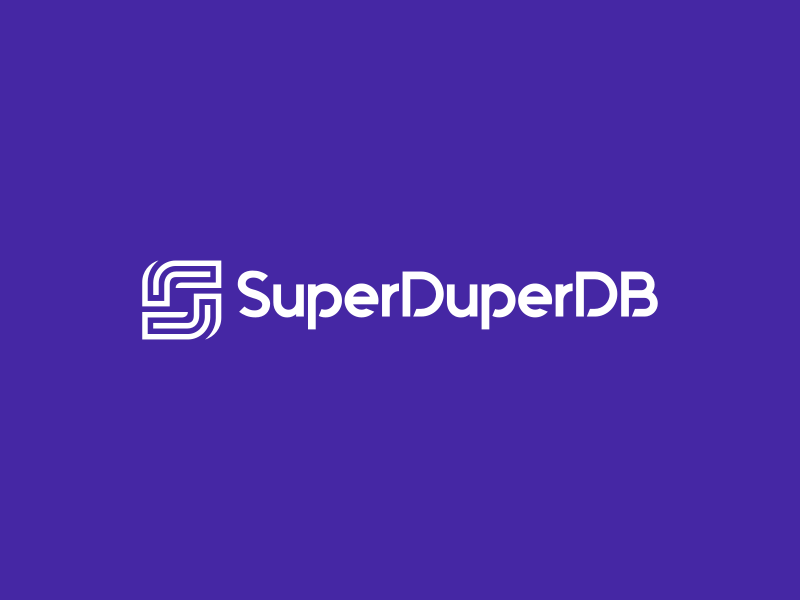
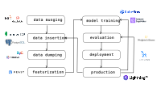
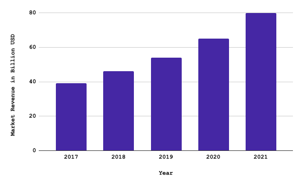
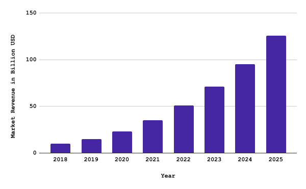
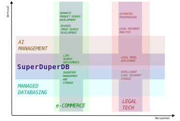

<!-- _class: lead 
_backgroundColor: #4527a4;
_style: | 
  h1 {
    text-color: #000000;
  }
-->



<center>
  <div style="color: white; padding-top: 18%;">
    <i>Superpower your database with AI</i>
  </div>
</center>

---

## Integrating AI and applying AI to data is a huge challenge

The AI lifecycle is highly complex, interdependent but fragmented.



---

## Current solutions highly limit and hamper development and deployment of AI

- Huge operational and infrastructure overhead from injestion to deployment
- Not ready for the latest AI advances since models and data can't talk directly to each other

---

# Data and AI need to be fully united in order to maximize their value

---

# Introducing SuperDuperDB

### The first fully fledged and open source AI-data solution

---

## SuperDuperDB: Integrating AI directly into your data-base, -lake, -warehouse


---

## SuperDuperDB is a unified environment for the entire AI-data workflow

### Computation of new output happens directly on the data - outputs are stored directly with the input data


---

## Key Features

- Install **arbitrary** models in **a range of** datastores
- Train these models flexible directly with the datastore
- Query model outputs using vector search and beyond
- End-2-end open source
- Scalable deployment on Kubernetes

---

## SuperDuperDB v0.1

- Arbitrary AI models "installable" and "trainable" directly in the datastore
- Datastore support initially MongoDB and DuckDB
- SuperDuperDB enables queries using new techniques, including but not limited to vector search

---

<style scoped>
table {
  font-size: 15px;
}
</style>

## There is nothing out there like SuperDuperDB

<center>

| | [SuperDuperDB](https://www.superduperdb.com/) | [MindsDB](https://mindsdb.com/) | [PostGresML](https://postgresml.org/) | [DeepLake]() | [LanceDB](https://eto.ai/) | [Continual](https://continual.ai/) | [PineCone](https://www.pinecone.io/) | [Chroma](https://docs.trychroma.com/) |
| - | :-: | :-: | :-: | :-: | :-: | :-: | :-: | :-: |
| AI models in database | ✅ | ✅ | ✅ | ❌ | ❌ | ❌ | ❌ | ❌ |
| Open Source | ✅ | ✅ | ✅ | ✅ | ✅ | ❌ | ❌ | ✅ |
| Unified environment | ✅ | ✅ | ✅ | ✅ | ❌ | ❌ |❌| ❌ |
| Train AI models in database | ✅ | ✅ | ✅ | ❓ | ❌ | ❌ | ❌ | ❌ |
| Vector Search | ✅ | ❌ | ✅ | ❌ | ✅ | ✅ | ✅ | ✅ |
| Scalable compute | ✅ | ❌ | ✅ | ❌ | ❓ | ❌ | ✅ | ❌ |
| Python first | ✅ | ❌ | ❌ | ✅ | ✅ | ❌ | ❌ | ❌ |
| Flexible data types | ✅ | ❌ | ❌ | ✅ | ✅ | ❓ | ❌ | ❌ |
| Arbitrary AI models | ✅ | ❌ | ❌ | ✅ | ❌ | ❌ |❌| ❌ |
| Arbitrary datastore |✅  | ✅ | ❌ | ❌ | ❌ | ❌ | ❌ | ❌ |

</center>

---

## Use case: vector search with OpenAI

Use OpenAI, to make documents instantly searchable using natural language:

```python
>>> from superduperdb.apis.openai import Embedding
>>> docs.insert_many([d for d in data])
>>> docs.create_model(Embedding('text-embedding-ada-002'), keys=['text'])
>>> docs.find(like={'text': 'Articles about biotech'}, semantic_index='gpt4/text')
```

---

## Use case: vector search with Hugging Face

Use Hugging Face library (not API) to search documents:

```python
>>> from sentence_transformers import pipeline
>>> docs.create_model(pipeline('multi-qa-distilbert-dot-v1'), keys=['text'])
>>> docs.find({'text': 'Articles about biotech'}, semantic_index='multi-qa-distilbert-dot-v1')
```

---

## Use case: personal assistant referencing private voice memos 

Create a personal assistant on private cache of voice memos/ zoom meetings. *"Summarize what we talked about in the last few meetings, on the topic of sales."*

```python
>>> import torch
>>> from superduperdb.models.openai import RetrievalChatCompletion
>>> model, decoder, utils = torch.hub.load(repo_or_dir='snakers4/silero-models', model='silero_stt', language='en')
>>> docs.create_model(model, preprocess=utils[-1], postprocess=decoder, keys=['audio'])
>>> docs.create_model(pipeline('multi-qa-distilbert-dot-v1'), keys=['audio'], features={'audio': 'silero_stt'})
>>> docs.create_model(RetrievalChatCompletion('gpt-4'), features={'audio': 'multi-qa-distilbert-dot-v1'})
>>> docs.predict_one('gpt-4', 'Is there a reference here to the roadmap from September?')
```

---

## Use case: anomaly detection for SAP-like companies

Instantly use AI to detect intrusive or unusual data, in the moment it is ingested to the enterprise:

```python
>>> from transformers import *  # use Hugging-Face library (open-source)
>>> from my_codebase.models import VAE   # in-house code-base for anomaly detection
>>> import torch                       # torch standard library
>>> docs.create_model('bert', BertModel(BertConfig()), key='text')
>>> docs.create_learning_task('anomaly',
...                           model={'input': 'text', 'model': VAE()}, 
...                           target={'input': 'text', 'model': torch.nn.Identity()},
...                           features={'text': 'bert'},
...                           loss={'anomaly-loss': torch.nn.BCELoss()})
# (lots of output) model trains aynschronously on server
>>> outliers = docs.find({'_outputs.text.anomaly': {'$leq': 0.001}})  # find outliers with database query
```

---

## Use-case: e-Commerce semantic text-search, similar product recommendation, reverse image search

Instantly install a full stack of e-commerce search and navigation, including image search:

```python
>>> products.insert_many(product_list)
>>> products.create_learning_task(
...    'shop_index',
...    [{'name': 'text-searcher', 'object': text_model, 'key': 'query'},
...     {'name': 'product-indexer', 'object': product_model, 'key': 'product'},
...     {'name': 'street-image', 'object': image_model, 'key': 'image'}]
... )
>>> docs.find({'brand': 'Adidas'}, like={'query': 'leopard print t-shirt'})
>>> docs.find({'brand': 'Nike'}, like={'image': {'_content': {'url': '<image-url'}}})
```

---

## SuperDuperDB minimizes overhead and revolutionizes AI capabilities

- Training and deployment of AI models massively simplified
- AI models become easily accessible to independent developers as well as organizations
- Model outputs instantly available in known data environment for various teams and apps
- AI models can perform entirely new operations by having direct access to all data 
- AI handles new incoming data and streaming automatically

---

## SuperDuperDB will allow companies to fully own their AI and data stack

### The SuperDuperDB core codebase will be open sourced under Apache License 2.0

- Companies will be able to deploy their AI and models in a unified way in their own data centers.
- Their entire stack will be transparent and no longer locked in behind SaaS and cloud providers.

---

## SuperDuperDB enables a variety of well tested business models

- Tiered managed cloud service
- On premises solution with technical support
- Model repository (like "App Store")
- Consulting
- Certifications

---

## Viral adoption in the developer community 

### Community interest and adoption drives corporate integrations


---

## We aim to make large in-roads into DBMS and managed AI

Both [managed database](https://blogs.gartner.com/merv-adrian/2022/04/16/dbms-market-transformation-2021-the-big-picture/) and [AI market](https://www.gartner.com/en/newsroom/press-releases/2021-11-22-gartner-forecasts-worldwide-artificial-intelligence-software-market-to-reach-62-billion-in-2022) are already huge and still growing fast 

<div class="columns">
<div style="margin-top: 5%;">

<center>DBMS</center>



</div>
<div style="margin-top: 5%">

<center>AI Software</center>



</div>
</div>

---

## Using SuperDuperDB we will be able to instantly spawn managed services wherever AI provides substantial value

### For example

- Legal tech (*e.g. advanced document analysis*)
- e-Commerce (*e.g. search, navigation, recommendation*)
- Biomedical (*e.g. semantic image segmentation*)
- Cybersecurity (*e.g. fraud detection*)

---

## We will build and offer specialized functionalities for key verticals 




---

## SuperDuperDB is already in full swing

### Progress

- Working prototype v0.1 in Python
- Installable via Python `pip`
- Outstanding feedback from inner developer circle

---

## The founders have a proven combination of skill sets and remarkable joint track record


<div class="columns">
<div style="margin-top: 10%;">

<center>


<b>Duncan Blythe [:link:](https://www.linkedin.com/in/duncan-blythe-71877312b/)</b>
CTO: AI Research, software development

</center>

</div>
<div style="margin-top: 10%">

<center>


<b>Timo Hagenow [:link:](https://www.linkedin.com/in/timohagenow/)</b>

CEO: Operations, marketing, sales

</center>

</div>
</div>

---

## SuperDuperDB draws on over a decade of experience in managed AI

### Duncan Blythe [:link:](https://www.linkedin.com/in/duncan-blythe-71877312b/), MMathPhil, MSc, PhD

- Graduated first in class Oxford Mathematics 2007
- 1,000s citations on AI research, 10,000s of stars on GitHub open source
- Co-founded AI innovation lab lf1.io 2019
- Co-founded and exited alephsearch.com (bootstrapped) 2020 to attraqt.com with team of 2 for mid 7-figure ([press release](https://www.sharecast.com/news/aim-bulletin/attraqt-to-acquire-ai-search-platform-aleph--7661235.html))
- Led AI integration and strategy at attraqt.com to exit 2022 ([press release](https://newsnreleases.com/2022/09/29/crownpeak-holdings-will-acquire-attraqt-group-for-63-2-million/))

---

## SuperDuperDB will profit from experience in scaling businesses

### Timo Hagenow [:link:](https://www.linkedin.com/in/timohagenow/), MBA

- Founded  adtech company yieldlove.com (2013), exited (2017) to market leader stroeer.de and scaled annual revenue to over 50 million euro ([press release](https://www.stroeer.de/en/newsroom/press/expansion-of-technological-platform-marketing-stroeer-acquires-programmatic-platform-and-header-bidding-specialists-yieldlove/))
- Co-founded AI innovation lab lf1.io 2019
- Co-founded and exited alephsearch.com (bootstrapped) 2020 to attraqt.com with team of 2 for mid 7-figure  ([press release](https://www.sharecast.com/news/aim-bulletin/attraqt-to-acquire-ai-search-platform-aleph--7661235.html))
- Co-founded [sheen-ai.com](https://www.sheen-ai.com/) 2022

---

## Hire #1

### Tom Ritchford [:link:](https://www.linkedin.com/in/tomritchford/), BSc Mathematics

- Google Engineer 2005-9
- Ripple Engineer 2014-16
- Diverse startup experiences as engineer/ CTO
- 100s of stars on own individual open source projects
- Diverse programming skills, specialist in Python, C++

---

## Hire #2

### Oleksandr Dashyn [:link:](https://www.linkedin.com/in/oleksandr-danshyn/), BSc Engineering

- Serial founder (CTO/ CPO/ CEO)
- Full stack engineer
- Fully fledged data engineer - Data Robot 2015-18
- Co-created [Neu.ro](https://neu.ro/)
- Diverse knowledge of DevOps, MLOps, Cloud technologies

---

## Hire #3 (Chief Data Scientist)

### Stealth Candidate

- Honorary lecturer (associate professor) at UCL
- 2 PhDs
- 1000s of stars on Open Source
- Years of experience in industry and academia

---

## Timeline: in the initial year we will develop and market-test a rock-solid MVP


---

## Strategy: Open-core

- Hosting on GitHub with project page and full documentation
- Use standard scaling strategies on GitHub to gain viral adoption
- Basis on most popular components, leads to high adoption:
  - PyTorch (used by openAI)
  - MongoDB (most popular document store)
- Core functionality open-source
- Bells and whistles not included

---

## Strategy: Managed cloud hosted services

- Host fully managed and configurable SuperDuperDB deployments
  - AWS
  - GCloud
  - Azure
- Integration to existing hosted MongoDB deployments possible

---

## Strategy: Managed onsite self-hosting

- Compiled binaries for easy self-hosting
- Support and consultation

---

## Strategy: Marketplace

- Marketplace of models and datasets
- Enable third-party sellers to revenue
- Enable friendly agreements with competition e.g. Hugging Face

---

## Strategy: Tune-ups and interfaces

- Open-core contains key-functionality
- Sell licenses for:
  - User interfaces
  - High-level work flows
  - Validation dashboards and management

---

## Strategy: Professional services 

- Tiered support
- Certifications
- Coaching and on-site consulting

---

## Strategy: Vertical expansion

- Bespoke models for key use-cases
- In-house team of data-scientists and SuperDuperDB specialists build models
- Integration to hosted or non-hosted SuperDuperDB deployment
- Per-request or per-model pricing possible
