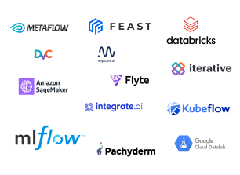

<!-- _class: lead 
_backgroundColor: #4527a4;
-->


---

## Integrating AI and applying AI to data is a huge challenge

<div class="columns">
<div style="margin-top: 10%;">

The AI lifecycle is highly complex, interdependent but fragmented.
Various stages in the lifecycle are supported by distinct competing
providers.

Companies with 8 figure revenue waste 10s-100 of millions $ on doing this

</div>
<div style="margin-top: 5%">


</div>
</div>

---

## The different providers are fragmented and not interoperable



---

# *No open source solution supports these steps in a unified way*

---

## Traditional AI includes all knowledge *in* the model


This is contrary to human intelligence, which incorporates external knowledge, and uses fluid intelligence to make inferences based on this external knowledge

---

## However, the latest developments will allow AI to "look up" information


From the internet, from books, from user feedback ...

---

## This means new AI needs to interoperate closely with the data

- Looking up important insights from the data
- Reading new streaming data
- Updating data on the fly
- Pushing incoming data through the AI model

---

# *No existing solution can handle these needs*

---

# Introducing SuperDuperDB

---

## SuperDuperDB

### ...aims to revolutionize how companies and organizations work with and apply AI to their data

---

## SuperDuperDB

### ...is based on the fact that *true AI* unites deep learning and data insights


---

## SuperDuperDB

### ...will unite best in class database and deep learning software


---

## SuperDuperDB

### ...will lead to deployments and development with never seen before simplicity

1 python command creates deployed multimodal semantic search

```python
collection.create_semantic_index(
    filter={'vertical': 'groceries'},
    model=my_model,    # user supplied PyTorch model
    keys=['query', 'product']
)
```

---

## SuperDuperDB

### ...will allow users to navigate data in a totally new way using the power of AI

Semantic indices available with `$like` operator

```python
results = collection.find({
    'vertical': 'groceries',
    'shop': 'cosco',
    '$like': {'document': example, 'n': 10}
})
```

---

## SuperDuperDB

### ...is infinitely modifiable

...and makes any learning problem with (sub)records as datapoints doable

```python
collection.create_model(
    filter={'type': 'legal'},
    model=second_model,
    loss=my_loss,
    metrics=my_metrics,
)
```

---

## SuperDuperDB is based on sleek and shrewd design decisions

### PyTorch is the most popular AI framework among experts

(Source: [horace.io](http://horace.io/pytorch-vs-tensorflow/))

| Rank | Percentage Papers | Framework  |
| ---- | ----------------- | ---------- |
| 1.   | 84%               | PyTorch    |
| 2.   | 16%               | Tensorflow |

---

## SuperDuperDB is based on sleek and shrewd design decisions

### MongoDB is the most popular document store in use today

(Source: [db-engines.com](https://db-engines.com/en/ranking/document+store))

| Rank | Database                  | Score |
| ---- | ------------------------- | ----- |
| 1.   | MongoDB                   | 486   |
| 2.   | Amazon DynamoDB           | 88    |
| 3.   | Databricks                | 58    |
| 4.   | Microsoft Azure Cosmos DB | 40    |

---

## SuperDuperDB is based on sleek and shrewd design decisions

### Experience building agile AI in Academia, Zalando, LF1 and Attraqt has allowed us to test these choices

PyTorch together with MongoDB allow for deep learning built ***with ease, on a shoestring***.

Developers ***love*** these tools ***passionately***.

---

## Team: SuperDuperDB draws on over a decade of experience in managed AI

### Duncan Blythe

- Graduated first in class Oxford Mathematics 2007
- MMathPhil, MSc, PhD
- 1,000s citations on published top AI research
- 10,000s of stars on GitHub open source
- Co-founded and exited AlephSearch (bootstrapped) 2020 to Attraqt PLC with team of 2 for mid 7-figure
- Deep learning, software development, infrastructure, technical lead

---

## Team: SuperDuperDB will profit from the involvement of successful entrepreneurs

### Timo Hagenow

- MBA, Hamburg Media School
- Founded Yieldlove GmbH 2013 and scaled to 8 figure revenue
- Exited Yieldlove GmbH to Ströer (market leader)
- Co-founded and exited AlephSearch (bootstrapped) 2020 to Attraqt PLC with team of 2 for mid 7-figure
- Operational, sales, marketing, strategy, product expertise

---

## SuperDuperDB is already in full swing

### Progress

- Working prototype v0.1 in Python
- Installable via Python `pip`
- Initial traction via social media
- Response positive

---

## SuperDuperDB enables a range of well tested business models

- Tiered managed cloud service
- On premises solution with technical support
- Model repository (like "App Store")
- Sub-brands:
  - **LegalTech/ NLP/ e-Commerce/ Biomedical/ Cybersecurity...**
- Consulting
- Certifications

---

## The potential market for SuperDuperDB is huge

### 2019


---


## ... and rapidly growing

### 2022 


---

## ... and rapidly growing

### 2023 onwards


---

## With SuperDuperDB we aim to

### ... make large in-roads into the managed database market

Managed databases is a huge market with unprecedented growth (source: [gartner.com](https://blogs.gartner.com/merv-adrian/2022/04/16/dbms-market-transformation-2021-the-big-picture/))

| Year | Market Size ($) |
| ---  | --------------- |
| 2022 | 80 Billion      |
| 2020 | 65 Billion      |
| 2017 | 39 Billion      |

---

## ...and the managed AI software market

AI software is a burgeoning new market already with huge reach (source: [gartner.com](https://www.gartner.com/en/newsroom/press-releases/2021-11-22-gartner-forecasts-worldwide-artificial-intelligence-software-market-to-reach-62-billion-in-2022))

| Year | Market Size ($) |
| ---- | --------------- |
| 2022 | 63 Billion      |
| 2021 | 52 Billion      |

---

## Timeline


---

<style scoped>
table {
  font-size: 20px;
}
</style>


## The Ask

**1 year, 1.2 million €**

| Item                 | Count | Cost unit (€) | Cost (€) |
| -------------------- | ----- | ------------- | -------- |
| Python developer     | 3     | 80,000        | 240,000  |
| Cloud engineer       | 2     | 90,000        | 180,000  |
| Research scientist   | 2     | 100,000       | 200,000  |
| Marketing            | 1     | 60,000        | 60,000   |
| Cloud Infrastructure | 1     | 100,000       | 100,000  |
| Management           | 1     | 100,000       | 100,000  |
| Miscellaneous        | 1     | 200,000       | 200,000  |