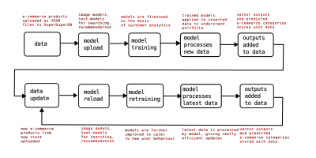

<!-- _class: lead 
_backgroundColor: #4527a4;
_style: | 
  h1 {
    text-color: #000000;
  }
-->

  

    <i>Superpower your database with AI</i>
  

---

## Integrating AI and applying AI to data is a huge challenge

The AI lifecycle is highly complex, interdependent but fragmented.

---

## Current solutions don’t enable efficient interoperability between data and models 

- Data preparation and processing causes huge overhead 
- No intelligent information lookup on the fly by the model
- No handling of new data points (streaming)

---

## Companies do not own their data and AI

**Companies want**

- 100% control over their infrastructure and deployments
- To avoid vendor lock-in by cloud and SaaS providers
- Transparency & auditability over what happens with their data

---

# Data and AI need to be fully united in order to maximize their value

---

# SuperDuperDB

### The first fully fledged AI-database solution

---

## SuperDuperDB: Integrating AI directly into your database

### Uniting best in class database and deep learning software

---

## A solution for data scientists designed by data scientists

### SuperDuperDB allows full flexibility and maximal agility

- Train and develop arbitrary AI models without infrastructural overhead.
- Deploy live AI models to the database to give unprecendented data navigation 
and comprehension.

---

## SuperDuperDB is a unified environment for the entire AI-data workflow

### Computation of new output happens directly on the data - outputs are stored directly with the input data

---

## SuperDuperDB minimizes overhead and revolutionizes AI capabilities

- Complex data preparation and processing is no longer required
- AI models can perform entirely new operations by having access to all data 
- AI can handle new incoming data and streaming

---

## SuperDuperDB will allow companies to fully own their AI and data stack

### The SuperDuperDB core codebase will be open sourced under Apache License 2.0

- Companies will be able to deploy their AI and models in a unified way in their own data centers.
- Their entire stack will be transparent and no longer locked in behind SaaS and cloud providers.

---

## Example: with SuperDuperDB instantly deploy a full-stack of e-Commerce AI

<!-- (*Write e-commerce stuff in the boxes*) -->

---

## SuperDuperDB enables a variety of well tested business models

- Tiered managed cloud service
- On premises solution with technical support
- Model repository (like "App Store")
- Consulting
- Certifications

<!-- ---

## The potential market for SuperDuperDB is huge

### 2019

---

## ... and rapidly growing

### 2022 

---

## ... and rapidly growing

### 2023 onwards

 -->

---

## We aim to make large in-roads into DBMS and managed AI

Both [managed database](https://blogs.gartner.com/merv-adrian/2022/04/16/dbms-market-transformation-2021-the-big-picture/) and [AI market](https://www.gartner.com/en/newsroom/press-releases/2021-11-22-gartner-forecasts-worldwide-artificial-intelligence-software-market-to-reach-62-billion-in-2022) are already huge and still growing fast 

DBMS

AI Software

---

## Using SuperDuperDB will be able to offer outstanding offerings wherever AI provides substantial value

### For example

- Legal tech (*e.g. advanced document analysis*)
- e-Commerce (*e.g. search, navigation, recommendation*)
- Biomedical (*e.g. semantic image segmentation*)
- Cybersecurity (*e.g. fraud detection*)

---

## We will build and offer specialized functionalities for key verticals 

---

## SuperDuperDB is already in full swing

### Progress

- Working prototype v0.1 in Python
- Installable via Python `pip`
- Outstanding feedback from inner developer circle

---

## The founders have a proven combination of skill sets and remarkable joint track record

<b>Duncan Blythe [:link:](https://www.linkedin.com/in/duncan-blythe-71877312b/)</b>

Development, AI research

<b>Timo Hagenow [:link:](https://www.linkedin.com/in/timohagenow/)</b>

Operations, marketing, sales

---

## SuperDuperDB draws on over a decade of experience in managed AI

### Duncan Blythe [:link:](https://www.linkedin.com/in/duncan-blythe-71877312b/), MMathPhil, MSc, PhD

- Graduated first in class Oxford Mathematics 2007
- 1,000s citations on AI research, 10,000s of stars on GitHub open source
- Co-founded AI innovation lab lf1.io 2019
- Co-founded and exited alephsearch.com (bootstrapped) 2020 to attraqt.com (WKN A12C9P) with team of 2 for mid 7-figure ([press release](https://www.sharecast.com/news/aim-bulletin/attraqt-to-acquire-ai-search-platform-aleph--7661235.html))
- Led AI integration and strategy at attraqt.com to exit 2022 ([press release](https://newsnreleases.com/2022/09/29/crownpeak-holdings-will-acquire-attraqt-group-for-63-2-million/))

---

## SuperDuperDB will profit from experience in scaling businesses

### Timo Hagenow [:link:](https://www.linkedin.com/in/timohagenow/), MBA

- Founded  adtech company yieldlove.com (2013), exited (2017) to market leader stroeer.de (WKN 749399) and scaled annual revenue to over 50 million euro ([press release](https://www.stroeer.de/en/newsroom/press/expansion-of-technological-platform-marketing-stroeer-acquires-programmatic-platform-and-header-bidding-specialists-yieldlove/))
- Co-founded AI innovation lab lf1.io 2019
- Co-founded and exited alephsearch.com (bootstrapped) 2020 to attraqt.com (WKN A12C9P) with team of 2 for mid 7-figure  ([press release](https://www.sharecast.com/news/aim-bulletin/attraqt-to-acquire-ai-search-platform-aleph--7661235.html))
- Co-founded [sheen-ai](https://www.sheen-ai.com/) 2022

---

## Timeline

---

## The Ask

**1 year, 1.1 million €**

| Item                 | Count | Cost unit (€) | Cost (€) |
| -------------------- | ----- | ------------- | -------- |
| Python developer     | 3     | 80,000        | 240,000  |
| Cloud engineer       | 2     | 90,000        | 180,000  |
| Research scientist   | 2     | 100,000       | 200,000  |
| Marketing            | 1     | 60,000        | 60,000   |
| Management           | 1     | 100,000       | 100,000  |
| Miscellaneous        | 1     | 200,000       | 200,000  |
